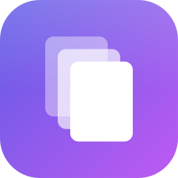

[English](./README.md) | **Русский**

<p align="center">
  
</p>

# MaCopy by ilkome

Менеджер буфера обмена для macOS. Живёт в строке меню, глобальный хоткей (по умолчанию **⌘`**, настраивается) открывает плавающую панель с историей.

## Требования

- macOS 14 Sonoma или новее
- Swift 6 toolchain (Xcode 16+)

## Сборка

Для работы с Accessibility (автоматическая симуляция ⌘V) приложение должно быть в `.app`-бандле:

```bash
./build-app.sh
```

Создаст `MaCopy by ilkome.app` рядом с `Package.swift`. Скрипт:
- собирает release-бинарь
- пакует в `.app` со стабильным bundle id `dev.ilkome.MaCopy`
- подписывает приложение (см. раздел "Подпись" ниже)

### Подпись и постоянный Accessibility permission

Без платного Apple Developer Program можно создать self-signed сертификат - разрешение Accessibility будет сохраняться между пересборками, TCC запоминает permission по стабильной designated requirement сертификата.

Однократная настройка:

```bash
./setup-signing.sh
```

Создаст сертификат `MaCopy Dev` в login keychain (trust scope ограничен только code signing). После этого:

1. `./build-app.sh` будет подписывать этим сертификатом
2. Один раз выдай Accessibility: **Системные настройки → Приватность и безопасность → Универсальный доступ**, добавь `.app` и включи тумблер
3. Последующие `build-app.sh` переиспользуют тот же permission

Если сертификата нет - скрипт упадёт на ad-hoc подпись (permission будет сбрасываться на каждой пересборке).

Удаление сертификата:
```bash
security delete-identity -c "MaCopy Dev"
```

## Запуск

```bash
open MaCopy by ilkome.app
```

Или двойным кликом в Finder. В строке меню появится 📋.

### Первый запуск - Accessibility permission

При первой попытке вставки macOS покажет запрос доступа. Если не показал:

1. **Системные настройки → Приватность и безопасность → Универсальный доступ**
2. `+`, выбери `MaCopy by ilkome.app`
3. Включи тумблер напротив

Без этого разрешения содержимое копируется в буфер, но автоматического ⌘V не будет.

## Управление

### Глобально

- **⌘`** (по умолчанию, меняется в Настройках) — показать/скрыть панель. Панель всплывает поверх, не забирает фокус у активного окна

### В открытой панели

- **↑ / ↓** — навигация по списку
- **← / →** — переключение вкладок (Избранное / Все / Ссылки / Изображения / Цвета / Код)
- **Enter** — вставить выделенный элемент в то окно, которое было активно до открытия панели
- **⇧+Enter** — скопировать в буфер без вставки
- **⌘+Enter** — открыть выбранную ссылку в браузере по умолчанию (только для URL)
- **⌘1 … ⌘9** — вставить один из первых 9 элементов напрямую (удерживайте ⌘, чтобы у них появились номера вместо иконки типа)
- **Двойной клик** — вставить
- **Esc** — скрыть панель
- **⌘⌫** — удалить элемент из истории (в пустом поле; в непустом — стандартный «удалить до начала строки»)
- **⌘S** — пометить как избранное
- **⌘D** — клонировать текстовый элемент (создаёт редактируемую копию)
- **⌘E** — фокус на редактор текста выбранного элемента
- **⌘W** — фокус на поле комментария к элементу
- **Space** — Quick Look для изображений
- **Ввод в поле поиска** — фильтрация
- **Иконка кнопки-пина** — закрепить панель, чтобы не закрывалась при потере фокуса

### Меню статус-бара

Правый клик (или Ctrl+клик) по 📋:

- **Настройки…** — открыть экран настроек внутри панели
- **Проверить обновления** — ручной триггер Sparkle
- **Выход**

OCR, превью ссылок, материал фона и хоткей живут в **Настройках** (открывается через меню или иконку шестерёнки в панели).

## Функциональность

### Захват

Polling `NSPasteboard.changeCount` каждые 300мс. Для каждого нового копирования сохраняется:
- содержимое (текст или PNG)
- источник: bundle id, имя и иконка приложения, из которого скопировано
- для файлов - путь
- timestamp

### Игнорирование приватных данных

Пропускаются элементы с типами `org.nspasteboard.ConcealedType`, `AutoGeneratedType`, `TransientType` (стандарт pasteboard.org, уважают 1Password/Bitwarden и т.д.), а также специфичные типы от 1Password и Bitwarden.

### Типизация

Автоматически определяется:

| Тип    | Как определяется                                                         |
|--------|--------------------------------------------------------------------------|
| URL    | Валидный `URL` со схемой http/https/ftp/file и host'ом                   |
| Color  | Hex (#fff, #ffffff, с/без `#`, 3/4/6/8 символов) или rgb()/rgba()/hsl()  |
| Code   | Эвристика: ключевые слова, плотность символов `{};()=<>`, отступы        |
| Image  | `.tiff`/`.png`/etc в pasteboard или file URL на картинку                 |
| Text   | Всё остальное                                                            |

### Дедупликация

SHA-256 от содержимого. Повторное копирование того же не дублирует запись, а обновляет `updatedAt` - элемент всплывает наверх истории.

### Хранение

Локально в `~/Library/Application Support/MaCopy/`:
- `clipboard.store` - SwiftData SQLite-база (метаданные, OCR, хеши, превью)
- `images/<uuid>.png` - полноразмерные картинки
- `icons/<bundle-id>.png` - кэш иконок приложений-источников

Лимита на количество элементов нет.

### Поиск

Регистронезависимый по `preview`, полному тексту, OCR-тексту скриншотов и имени приложения-источника.

### OCR

`Vision.VNRecognizeTextRequest`, языки `ru-RU` + `en-US`, уровень `.accurate`. Лимитер из 2 параллельных задач (`OCRConcurrencyLimiter`), чтобы одно крупное изображение не блокировало остальные. Результат пишется в модель и сразу доступен для поиска. Включается тумблером в Настройках.

### Превью ссылок

Для элементов типа URL подгружается title, описание и картинка (`OpenGraphParser` + `LPLinkMetadata`). Запросы in-flight отменяются при переключении на другой URL. Включается тумблером в Настройках.

### Комментарии и избранное

Каждому элементу можно добавить произвольный комментарий (ищется наряду с основным содержимым) и пометить как избранное (отдельная вкладка).

### Вставка

1. Записать содержимое в `NSPasteboard.general`
2. Скрыть панель (`orderOut`)
3. Активировать ранее активное приложение (`NSRunningApplication.activate`)
4. Через 80мс симулировать `⌘V` через `CGEvent.post(tap: .cghidEventTap)`
5. Если картинка битая / файл пропал - элемент удаляется из истории

### Фокус

`NSPanel` со стилем `.nonactivatingPanel` + activation policy `.accessory` + отсутствие `NSApp.activate()` при показе - панель получает ввод (текст в поиск, стрелки), но активное приложение не меняется. Курсор остаётся в исходном поле, и ⌘V вставляется именно туда.

## Стек

- **SwiftUI + AppKit** - UI, NSPanel, NSHostingView
- **KeyboardShortcuts** - настраиваемый глобальный хоткей
- **SwiftData** - персистентность с живым `@Query`
- **Vision** - on-device OCR, без сети
- **CryptoKit** - SHA-256 для дедупа
- **CGEvent** - симуляция нажатия ⌘V
- **ApplicationServices** - `AXIsProcessTrusted` для проверки Accessibility

Swift 6 strict concurrency, macOS 14+ only.

## Остановка

Пункт **Выход** в меню статус-бара, или:

```bash
pkill -x MaCopy
```

## Релизы и авто-обновления (Sparkle)

Sparkle интегрирован: приложение проверяет `appcast.xml`, сравнивает версии и скачивает обновления. Меню → **Проверить обновления** — ручной триггер.

### Одноразовая настройка ключей

1. `brew install --cask sparkle`
2. Сгенерировать EdDSA-пару (приватный ключ уходит в Keychain, публичный — в stdout):
   ```bash
   /opt/homebrew/Caskroom/sparkle/$(ls /opt/homebrew/Caskroom/sparkle | head -1)/bin/generate_keys
   ```
3. Скопировать публичный ключ из вывода, экспортнуть:
   ```bash
   export SU_PUBLIC_ED_KEY='<public key>'
   ```
   (чтобы не прописывать каждый раз — положи в `.zshrc`)

> `build-app.sh` падает, если `SU_PUBLIC_ED_KEY` не выставлена — дефолта нет. Сборка без публичного ключа, парного к твоему приватному, даст бинарник, который через Sparkle никем уже не обновится.

### Feed URL

По умолчанию `SUFeedURL` = `https://raw.githubusercontent.com/ilkome/macopy/main/appcast.xml`. Изменить через env: `SU_FEED_URL=https://... ./build-app.sh`.

### Выпуск новой версии

```bash
./release.sh 1.0.1
```

Скрипт:
1. Соберёт `.app` с нужной версией (`APP_VERSION=1.0.1`)
2. Упакует в DMG через `hdiutil` (с шорткатом на `/Applications`)
3. Подпишет EdDSA (`sign_update`)
4. Напечатает готовый `<item>` для `appcast.xml`

Дальше вручную:
- Вставь `<item>` в `appcast.xml` внутри `<channel>`
- `gh release create v1.0.1 release-artifacts/1.0.1/MaCopy-1.0.1.dmg --title "v1.0.1" --notes "..."`
- `git add appcast.xml && git commit -m 'release 1.0.1' && git push`

Пользователи получат уведомление об обновлении при следующем запуске (или через "Проверить обновления").

### Что делать, если `SUPublicEDKey` утёк или потерян

Приватный ключ Sparkle лежит в твоём login Keychain (`service=https://sparkle-project.org`, `account=ed25519`) и подписывает каждый релиз. Парный публичный ключ зашит в каждый `.app`, который ты отдаёшь пользователям. **Удалённого механизма отзыва нет**: как только установленная у пользователя MaCopy запомнила публичный ключ, единственный способ сменить trust anchor - выпустить новый билд с другим `SUPublicEDKey` и попросить переустановить вручную.

#### Бэкап приватного ключа (всегда перед переустановкой ОС или сменой машины)

```bash
security find-generic-password -s 'https://sparkle-project.org' -a 'ed25519' -w
```

Команда печатает приватник одной base64-строкой. Сохрани её там, откуда сможешь прочитать обратно после форматирования диска - конкретный инструмент значения не имеет, важно лишь чтобы значение пережило стирание системы. **Не коммить и не оставляй в открытом виде на расшаренном томе.** Без бэкапа переустановка ОС навсегда лишает существующих пользователей возможности получать обновления.

#### Восстановление ключа после переустановки ОС

Когда новая система готова, вставь сохранённую строку обратно в login Keychain:

```bash
security add-generic-password \
  -s 'https://sparkle-project.org' \
  -a 'ed25519' \
  -w '<твоя-сохранённая-base64-строка>' \
  -j 'Private key for signing Sparkle updates'
```

После этого `sign_update` (а значит и `release.sh`) снова найдёт ключ и подпишет DMG так же, как и раньше - переустановку существующие пользователи не замечают. Проверить, что всё на месте, можно повторно запустив команду бэкапа: она должна вывести ту же строку, что ты сохранил.

#### Если ключ утёк или безвозвратно потерян

1. Сгенерировать новую пару: `/opt/homebrew/Caskroom/sparkle/*/bin/generate_keys`.
2. Обновить `~/.zshrc`: `export SU_PUBLIC_ED_KEY='<новый публичный ключ>'`.
3. Поднять **major-версию** (например, `0.0.7` → `1.0.0`) и выложить новый билд только на GitHub Releases вручную. **Не публиковать** через существующий `appcast.xml` - клиенты доверяют старому ключу и всё равно отвергнут новый DMG.
4. В Release notes явно попросить пользователей переустановить вручную, дать прямую ссылку на скачивание.
5. Скомпрометированный ключ считать сожжённым навсегда: не использовать старый публичный ключ повторно, не оживлять старый appcast URL.

#### Усиление защиты приватного ключа

- Перенести приватник из обычного Keychain на YubiKey или Smart Card slot, если позволяет workflow (touch-confirm на каждом `sign_update`).
- Подписывать только локально на доверенной машине; не отдавать приватный ключ в CI.
- На машине с `release.sh` не запускать недоверенный код.

### Установка другими пользователями

Без платного Apple Developer Program первый запуск покажет Gatekeeper: **"Приложение от неопознанного разработчика"**. Обходится правым кликом → **Открыть** → **Открыть**. После этого все обновления через Sparkle работают без предупреждений.

## Очистка данных

```bash
rm -rf ~/Library/Application Support/MaCopy
```
